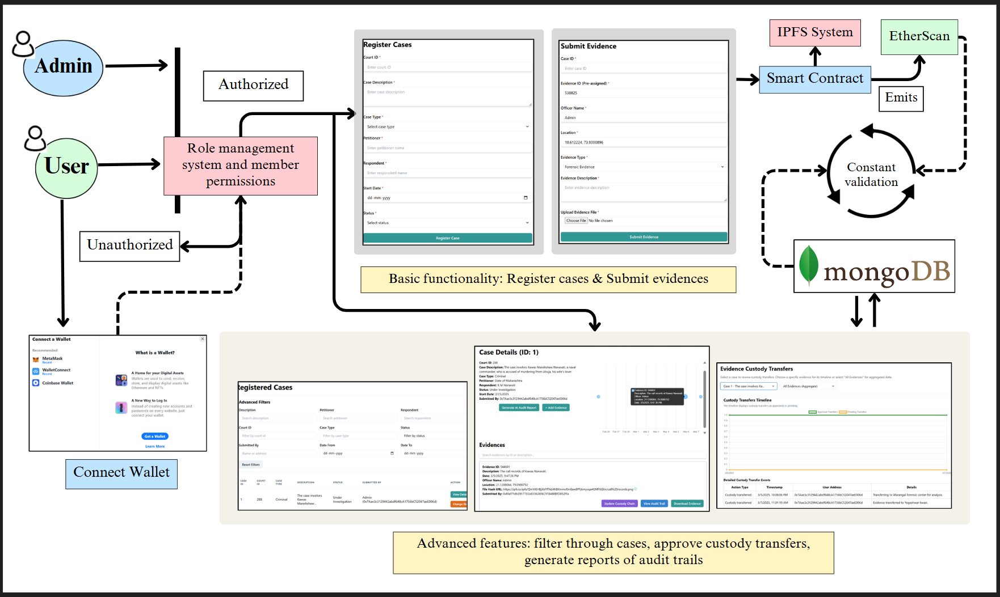
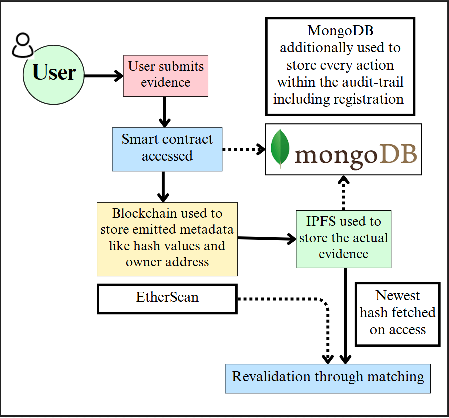
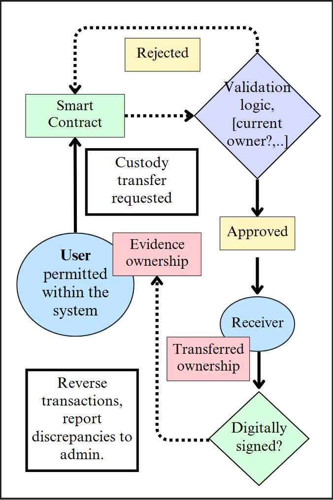

<div align="center">

# TraceX ⛓️

TraceX is an evidence management system designed to preserve the integrity of evidence in courts. This Decentralized Application enables users to upload evidence for any case number, ensuring data remains secure and transparent throughout its lifecycle.
TraceX incorporates a robust chain of custody feature, meticulously documenting each transfer of evidence to maintain a clear and unalterable record of its handling from collection to court presentation. Furthermore, digital signatures provide an additional layer of authentication and security, ensuring that only authorized individuals can access and manage the evidence.
TraceX creates a comprehensive digital trail, preventing any possibility of tampering and safeguarding the evidence's authenticity and reliability throughout the judicial process.
</div>

### To run the application in local, use: 
```bash
npm i
```
```bash
npm run dev
```
### UserFlow diagram:


### Understand how we validate integrity of evidences & handle custody transfers:

| Validation | Custody Transfers |
|---------|---------|
|  |  |

### Gallery: 


### Watch our video to understand how to use the features: 
[](https://www.youtube.com/watch?v=QYnjaIpiTPc)
